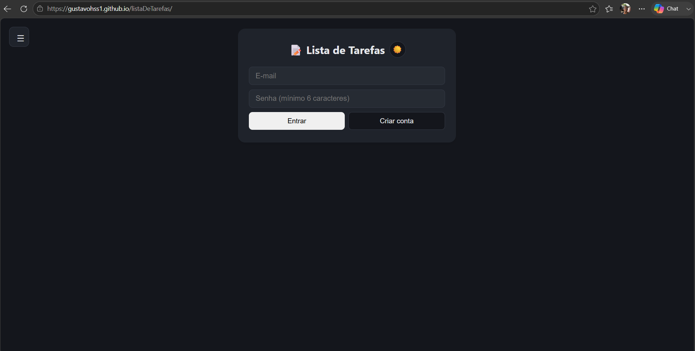

# 📝 Lista de Tarefas


Uma aplicação de lista de tarefas (To-Do List) desenvolvida com **HTML, CSS e JavaScript**, permitindo organizar compromissos do dia a dia de forma simples e intuitiva. Os dados ficam salvos na nuvem com **Firebase (Authentication + Firestore)**, então suas tarefas continuam disponíveis em qualquer dispositivo em que você fizer login.

---

## 📋 Sobre o projeto

Este projeto foi criado para praticar manipulação do DOM, autenticação de usuários, banco de dados em tempo real e organização de código em JavaScript puro (sem frameworks).

O projeto passou por várias rodadas de melhorias ao longo do desenvolvimento — algumas ideias (como categorias, recorrência de tarefas e favoritas) chegaram a ser testadas, mas foram removidas por não se encaixarem bem no uso real do app. O que ficou é o núcleo que funciona bem no dia a dia.

**Status: finalizado.** Isso não significa abandonado — atualizações pontuais podem acontecer com o tempo, mas não há mais funcionalidades grandes planejadas por enquanto.

---

## 🚀 Funcionalidades

- 🔐 Login e cadastro de usuário (Firebase Authentication)
- ✅ Adicionar, editar e remover tarefas
- ⏰ Definir horário e data para cada tarefa
- 🎨 Marcar tarefas com uma cor de destaque
- 📅 Calendário integrado, com visualização de tarefas por dia
- 📝 Adicionar observações às tarefas
- ☑️ Marcar tarefas como concluídas, com aba dedicada ao histórico
- 🌙 Alternância entre modo claro e modo escuro
- 👤 Área de conta com troca de senha
- ☁️ Dados salvos na nuvem (Firebase Firestore), sincronizados em tempo real
- 📱 Interface responsiva para dispositivos móveis

---

## 🛠️ Tecnologias utilizadas

- **HTML5**
- **CSS3**
- **JavaScript (ES6+, módulos)**
- **Firebase Authentication**
- **Firebase Firestore**

---

## 📁 Estrutura do projeto

```text
listaDeTarefas/
│
├── assets/
│   └── style.css
│
├── js/
│   ├── auth.js
│   ├── calendario-utils.js
│   ├── firebase-config.js
│   ├── menu.js
│   ├── script.js
│   ├── tarefas.js
│   └── tema.js
│
├── index.html
└── README.md
```

---

## 🚀 Como executar

1. Clone o repositório

```bash
git clone https://github.com/GustavoHSS1/listaDeTarefas.git
```

2. Entre na pasta do projeto

```bash
cd listaDeTarefas
```

3. Abra o arquivo `index.html` no navegador (ou sirva com uma extensão tipo Live Server).

> Não é necessário instalar dependências — o projeto usa apenas HTML, CSS e JavaScript no navegador. É necessário, porém, ter um projeto Firebase próprio configurado em `js/firebase-config.js` para autenticação e banco de dados funcionarem.

---

## 📸 Preview

<p align="center">
  
</p>

---

## 👨‍💻 Autor

Desenvolvido por **Gustavo Henrique** como projeto de estudo para praticar:

- Manipulação do DOM
- JavaScript moderno (módulos ES6)
- Autenticação e banco de dados com Firebase
- Organização de código
- Desenvolvimento Front-end

---

### ⭐ Se gostou do projeto, deixe uma estrela no repositório!